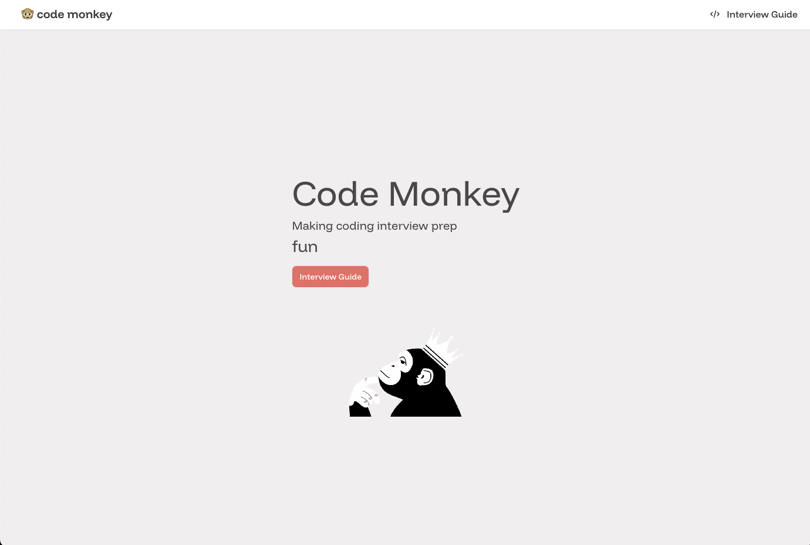

### Table of Contents

- [Introduction](#introduction)
- [Project Structure](#project-structure)
- [How to Contribute](#how-to-contribute)
- [Running/Building the App Locally](#runningbuilding-the-app-locally)



# Introduction

Code-Monkey is a website where I post tutorials on Algorithms & Data Structures and sometimes Interview Tips. It started as a college side project in my last semester at Purdue.

Originally, this project was much cooler—it had a feature where users could share LeetCode questions and solutions. But after many of my friends graduated and got jobs, people (including myself) stopped using it. If you dig through the Git history, you’ll still find the backend code written in Python with Django. Since maintaining it wasn’t worth the effort anymore, I removed the unused backend code and kept only the part where I can easily share tutorials using MDX.

# Project Structure

- Frontend: Next.js + TypeScript, [Contentlayer](https://contentlayer.dev/), [MDX](https://mdxjs.com/)
- Backend (removed): Python, Django, PostgreSQL

# How to Contribute

If you find something that seems off or could be explained better, feel free to open an issue on GitHub! If you’d like to contribute by writing a tutorial, please email me first to avoid duplicate efforts. Once we’re on the same page, go ahead and create a pull request with your changes—I’ll do my best to review it as soon as possible.

# Running/Building the App Locally

Run the development server with the following commands:

```sh
# Install dependencies
npm install

# Build the app
npm run build

# Run the development server
npm run dev
```

Open [http://localhost:3000](http://localhost:3000) in your browser to see the app. You don’t need to rebuild the app every time you make changes since the development server supports hot reload. But before pushing your code, make sure to build the app to ensure you're following the ESLint standards.
